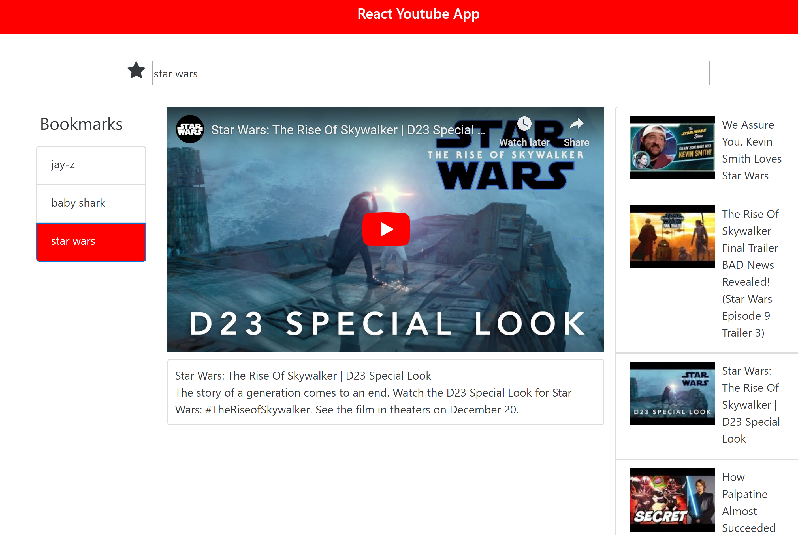

This is a [Reshuffle](https://reshuffle.com/template/youtube-search) template.

## About

Youtube search displaying results by searched input keys, save your search to your bookmarks list by clicking the favorite icon.

This project was inspired from [react-youtube-app](https://github.com/mimukit/react-youtube-app) repository.

## Configuring a Google API Key

This template does not include a Google YouTube API key. Without a key, the app will not show any videos.

To get and include your own Google API key:

1. Obtain a key following [these instructions](https://developers.google.com/youtube/v3/getting-started) (Skip this step if you already have a key)
2. Create a .env file in the root directory of the template
3. Insert the following line inside the .env file, replacing `<Your API KEY>` with your API key:

```
REACT_APP_YT_API_KEY=<YOUR API KEY>
```

## Screenshots


